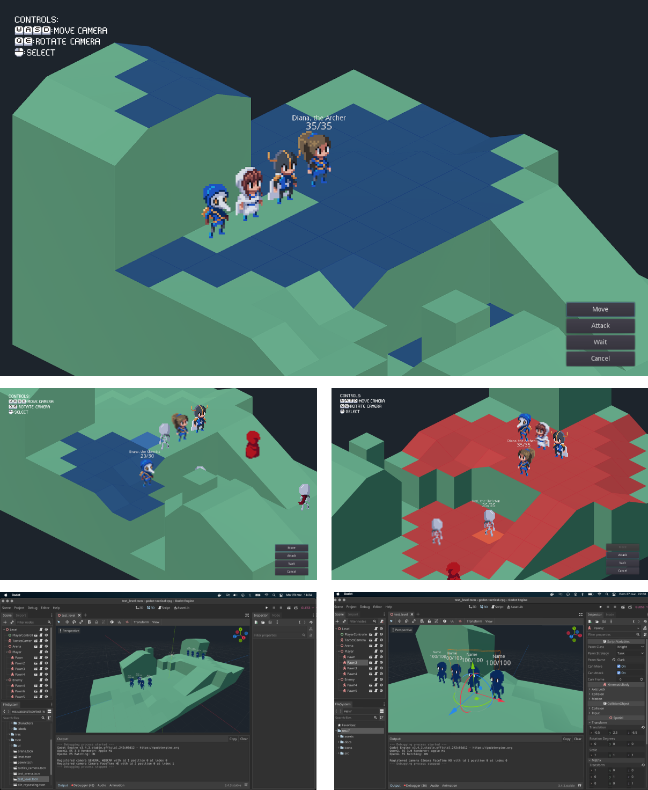

#### About

A simple template for making <i>tactical role-playing games</i> on [Godot Engine 4](https://godotengine.org/).
This is not a fully functional game framework or a professional work, just a simple project made in my free time. 
Anyways, feel free to use this sample in your own game. 

- You can see all project's features on [YouTube](https://youtu.be/lJKWlLwYDZY).
- Another demo from [Open Source Games](https://www.youtube.com/watch?v=-AY6KEdX_3E).
- In case you are searching for some 2d projects, checkout [GDQuest](https://github.com/GDQuest/godot-2d-tactical-rpg-movement) or [TBS_GoDot](https://github.com/ja-brouil/TBS_GoDot)

As mencioned before, this project uses [Godot Engine 4](https://godotengine.org/) (and was ported quite recently), so it will no longer support previous versions of the engine. If (for some reason) you still want to use an older version of Godot make sure to clone from the respective branch, but keep in mind that no new features will be added in the future.

#### Features

- Turn based plus grid movements
- Each pawn can move and attack
- Super basic (and stupid) enemy AI
- Camera movements and rotations
- Automatic battlegroud map recognition (req. Blender + Godot Export) [Here](./docs/tutorials/how-to-create-maps/README.md)
- Controller Support

#### Preview

#### Special thanks

- GDQuest
- Tiny Legions
- Miziziziz
- TutsByKai
- AdamCYounis
- Almost every other guy at Godot's formus / StackOverflow
